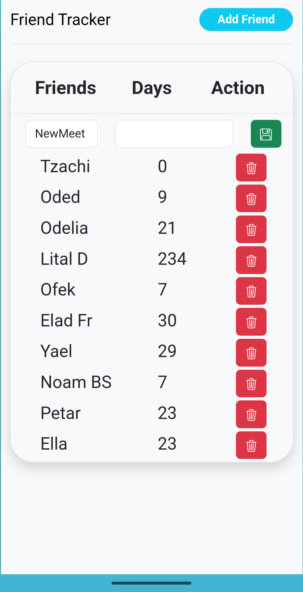

# See You Soon

[](https://www.python.org/downloads/)
[](https://www.djangoproject.com/)
[](https://www.sqlite.org/)

**See You Soon** is a web application designed to help you keep track of your friendships. It logs the last time you met with your friends and provides insightful statistics, such as the average and maximum time between meetings. This project was developed using the Django framework, demonstrating a solid backend foundation with dynamic frontend rendering.

## 🚀 Demo


## ✨ Features

  * **Friend Management**: Easily add, view, and manage a list of your friends.
  * **Meeting Logger**: Log each time you meet with a friend to keep your records up-to-date.
  * **Automated Tracking**: The application automatically calculates and displays the number of days elapsed since your last meeting with each friend.
  * **Insightful Statistics**: For each friend, view key statistics including the maximum and average number of days between meetings.
  * **Detailed View**: Click on any friend to see a detailed history of all your past meetings.
  * **Clean Interface**: A simple and intuitive user interface for a seamless user experience.

## 🛠️ Technologies Used

### Backend

  * **Python**: The core language used for the application's logic.
  * **Django**: A high-level Python web framework used to build the application's structure, views, and models.
  * **SQLite**: The default Django database, used for lightweight and efficient data storage.

### Frontend

  * **HTML5**: For the structure of the web pages.
  * **CSS3**: For custom styling and layout.
  * **Django Template Language**: To dynamically generate HTML content and display data from the backend.
  * **Bootstrap**: For responsive UI components.

## 📂 Project Structure

The project maintains a standard and organized Django application structure.

```
See_You_Soon/
├── See_You_Soon_Project/     # The Django project folder
│   ├── See_You_Soon/         # The main project configuration
│   │   ├── settings.py       # Project settings
│   │   ├── urls.py           # Project-level URL routing
│   │   └── ...
│   ├── friends/              # The Django app for managing friends and meetings
│   │   ├── migrations/
│   │   ├── static/           # CSS stylesheets
│   │   ├── templates/        # HTML templates for views
│   │   ├── models.py         # Database models (Friend, Meeting)
│   │   ├── views.py          # Application logic, calculations, and request handling
│   │   ├── urls.py           # App-level URL routing
│   │   └── ...
│   └── manage.py             # Django's command-line utility for administrative tasks
└── README.md
```

## 👤 Contact

Asaf Dov - [GitHub Profile](https://www.google.com/search?q=https://github.com/AsafDov)

Project Link: [https://github.com/AsafDov/See\_You\_Soon](https://github.com/AsafDov/See_You_Soon)


